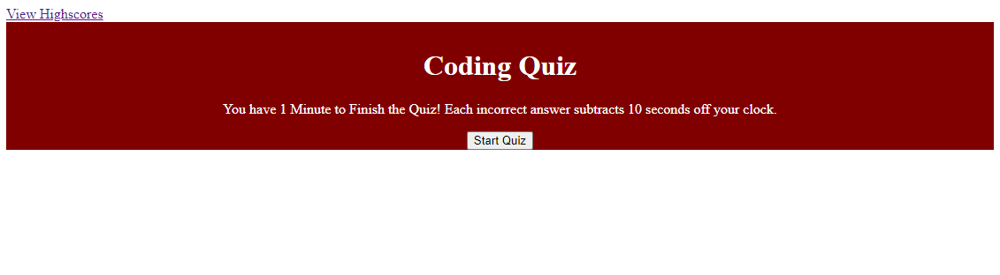
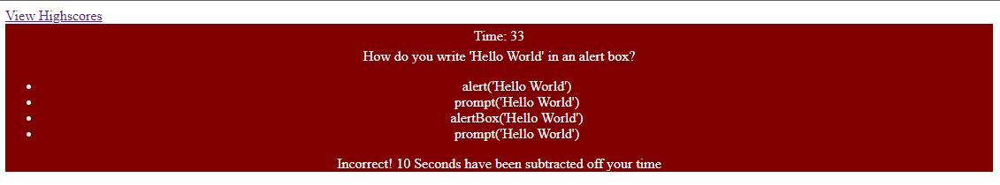

# CodingQuiz - Justin Asari

## About the Project
This project is a JavaScript based multiple choice quiz. It uses two HTML pages, one to display the home page and quiz, and the second for the high scores page. Once the quiz is started, the user has 60 seconds to complete the five question quiz with a penalty of 10 seconds for each incorrect answer. Once the quiz is completed or the timer runs out, the user is directed to submit their initials as well as being shown their score and how many questions they got correct.

The home page has a link to the highscore page on the upper left corner of the web document. The user can return to the home page of the quiz from the highscore page or clear the local storage of the scores. 

The quiz questions are contained within an array and is displayed once the user starts the quiz. Once the quiz starts, the timer starts counting from 60 seconds and the quiz is then rendered without showing the answer. An unordered list is created and displayed along with the correct amount of choices using a for loop. 

When an answer is chosen, the script checks if the user's choice matches with the pre-determined answer in the array. It then creates a div tag underneath the unordered list to show the user if they got the question correct or incorrect along with their penalty.

Once the quiz is done, the function creates the user submission page including the final score, an input box for the user's initials, and a submit button to save to the local storage. 

## Update Log
1. Quiz pushed to GitHub - January 19, 2022
2. Updated CSS and README - January 20, 2022

## Screenshots

